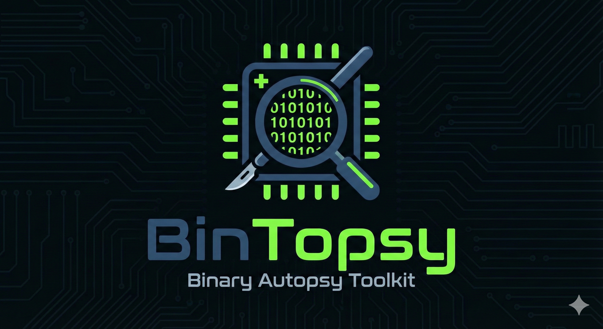

# BinTopsy

<p align="center">
  
</p>

**BinTopsy** (*Binary Autopsy*) is a collection of lightweight Python scripts
that assist in the early stages of static malware analysis and reverse
engineering.

The toolkit lets you visualise file entropy, disassemble code snippets on the
fly, scan binaries with YARA rules (paginated for large dumps), automate
threat-intelligence lookups via VirusTotal, and dissect binaries with
radare2 — extracting structural data, generating control-flow / call graphs,
tracing API usage, and clustering functions via fuzzy hashes.

[](https://www.gnu.org/licenses/gpl-3.0)

---

## Tools at a glance

| #  | Script                       | Purpose                                                       | Key deps              |
|----|------------------------------|---------------------------------------------------------------|-----------------------|
| 1  | `entropy-viz.py`             | 2D Shannon-entropy heatmap of a binary                        | numpy, matplotlib     |
| 2  | `disasm.py`                  | CLI disassembler (x86/x64/ARM/MIPS) for files & hex strings   | capstone              |
| 3  | `yara-chunk-scanner.py`      | Chunked, recursive YARA scanner with cross-chunk overlap      | yara-python           |
| 4  | `vt-folder-scan.py`          | Hash-only VirusTotal triage of a folder                       | requests, dotenv      |
| 5  | `r2-dissector.py`            | Radare2 dissector → JSON + CFG / call-graph PDFs              | r2pipe, graphviz      |
| 6  | `sda-hashes.py`              | Enriches dissector JSON with TLSH / ssdeep fuzzy hashes       | python-tlsh, ssdeep   |
| 7  | `r2-call-tracer.py`          | Brute-force call tracer (also resolves indirect IAT calls)    | r2pipe                |
| 8  | `json-behavior-analyzer.py`  | Behavioural matrix from a call-tracer JSON                    | stdlib                |
| 9  | `r2-call-graph.py`           | Targeted call graph rooted at a specific function (BFS depth) | r2pipe, graphviz      |
| 10 | `r2-xref-grapher.py`         | CFGs of every function calling a given API                    | r2pipe, graphviz      |

---

## Installation

### 1. System dependencies

Some Python packages wrap native libraries that must be present **before**
`pip install`:

| Tool / Library | Required by                                  | Debian / Ubuntu              | macOS (Homebrew)         |
|----------------|----------------------------------------------|------------------------------|--------------------------|
| Radare2        | `r2-dissector.py`, `r2-call-*.py`, `r2-xref-grapher.py` | `apt install radare2` | `brew install radare2`   |
| Graphviz       | `r2-dissector.py`, `r2-call-graph.py`, `r2-xref-grapher.py` | `apt install graphviz` | `brew install graphviz`  |
| libfuzzy       | `sda-hashes.py` (ssdeep)                     | `apt install libfuzzy-dev`   | `brew install ssdeep`    |

### 2. Clone & install Python deps

```bash
git clone https://github.com/reverseame/BinTopsy.git
cd BinTopsy
pip install -r requirements.txt
```

### 3. Configure VirusTotal (optional)

Only needed if you intend to use `vt-folder-scan.py`.

Create a file named `secrets.env` in the repo root (already gitignored):

```env
VT_API_KEY=your_64_character_api_key_here
```

---

## Usage examples

### 1. Entropy visualizer (`entropy-viz.py`)

**A. Quick overview of a packed executable** — default 4 KB window, default
64-column grid:
```bash
python entropy-viz.py samples/malware.exe -o overview.pdf
```

**B. High-resolution analysis (shellcode / steganography)** — 256-byte window
plus a wider grid for a denser map:
```bash
python entropy-viz.py suspicious_image.png -w 256 -W 128 -o high_res_map.pdf
```

> Padding at the end of the file is now **masked** (transparent), so it no
> longer looks like a fake low-entropy region.

### 2. Capstone disassembler (`disasm.py`)

**A. Shellcode from a hex dump** — disassemble inline, no file needed:
```bash
python disasm.py -s "55 48 89 e5 48 83 ec 20" -a x64
```

**B. IoT firmware (MIPS, big-endian)** — set base address and endianness:
```bash
python disasm.py -f firmware_bootloader.bin -a mips --big-endian --base 0x80001000
```

**C. Limit output** — first 30 instructions only:
```bash
python disasm.py -f sample.bin -a x86 -n 30
```

### 3. Chunk-based YARA scanner (`yara-chunk-scanner.py`)

**A. Memory dump** — scan an 8 GB raw dump in 4 MB chunks:
```bash
python yara-chunk-scanner.py memory_dump.raw ./rules/malware.yar -p 4194304
```

**B. Bulk directory scan** — recursive directory of files vs. directory of
rules:
```bash
python yara-chunk-scanner.py ./extracted_files/ ./rules_repo/ -p 4096
```

**C. Disable cross-chunk overlap** — for performance when rules have only
short strings:
```bash
python yara-chunk-scanner.py ./big_blob.bin ./rules.yar -p 65536 -O 0
```

> The default 1 KB overlap catches strings that straddle the boundary
> between two chunks; the previous version silently missed them.

### 4. VirusTotal folder scanner (`vt-folder-scan.py`)

**A. Triage a `Downloads` folder**, ignoring common media files:
```bash
python vt-folder-scan.py ~/Downloads --avoid .jpg .jpeg .png .mp4 .log .txt
```

**B. Premium key + JSON report**:
```bash
python vt-folder-scan.py ./incident_response_data --premium -o triage.json
```

**C. Limit by file size** to save quota:
```bash
python vt-folder-scan.py ./suspicious --max-size 10485760   # skip > 10 MB
```

### 5. Radare2 dissector (`r2-dissector.py`)

**A. Full JSON export** — metadata, entropy and basic blocks per function:
```bash
python r2-dissector.py samples/malware.exe --blocks > structural_analysis.json
```

**B. Visualization (call graph)** — global map of who-calls-whom:
```bash
python r2-dissector.py samples/malware.exe --call-graph -od ./graphs
```

**C. CFG of a single function**:
```bash
python r2-dissector.py samples/malware.exe -g sym.main -od ./graphs
```

### 6. Fuzzy-hash enricher (`sda-hashes.py`)

Adds TLSH and ssdeep hashes to the JSON produced by `r2-dissector.py`:
```bash
python sda-hashes.py structural_analysis.json
# → writes structural_analysis_enriched.json
```

Use only one algorithm:
```bash
python sda-hashes.py structural_analysis.json --tlsh
```

### 7. Brute-force call tracer (`r2-call-tracer.py`)

Walks every function and records direct + indirect (IAT) calls:
```bash
python r2-call-tracer.py samples/obfuscated.bin > call_trace.json
```

Compact JSON (smaller, no indentation):
```bash
python r2-call-tracer.py samples/obfuscated.bin --compact > call_trace.json
```

### 8. Behavioural matrix (`json-behavior-analyzer.py`)

**A. Triage** — only show functions with interesting capabilities:
```bash
python json-behavior-analyzer.py call_trace.json
```

Output highlights (colours):
- Yellow → file + network (downloader / dropper)
- Red → file + crypto (ransomware-like)
- Magenta → process injection (`VirtualAllocEx`, `WriteProcessMemory`, etc.)
- Cyan → heavy anti-analysis (≥3 such APIs)

**B. Verbose audit** — show every function, including GUI-only / generic
ones:
```bash
python json-behavior-analyzer.py call_trace.json --verbose
```

### 9. Targeted call graph (`r2-call-graph.py`)

Generates a focused call graph rooted at a specific function. Complements
`r2-dissector.py --call-graph`, which produces the *global* graph.

**A. From `main`, depth 4**:
```bash
python r2-call-graph.py samples/malware.exe main_subgraph.pdf -s main -d 4
```

**B. From an address**:
```bash
python r2-call-graph.py samples/malware.exe entry.pdf -s 0x401000 -d 5
```

Nodes are coloured by cyclomatic complexity (CC):
green = root, blue ≤ 10, yellow > 10, orange > 20, red > 50.

### 10. API xref grapher (`r2-xref-grapher.py`)

**A. List every import** with its xref count and the maximum CC of its
callers (rapid triage of "where is the danger?"):
```bash
python r2-xref-grapher.py samples/malware.exe -l
```

**B. Generate a CFG per caller of a specific API**:
```bash
python r2-xref-grapher.py samples/malware.exe VirtualAllocEx -o ./xref_graphs
```

**C. Substring matching** (e.g. catch both `RegOpenKey` and `RegOpenKeyEx`):
```bash
python r2-xref-grapher.py samples/malware.exe RegOpenKey --partial
```

> Default matching is **exact** (case-insensitive) to avoid false positives.

---

## Suggested pipeline

The radare2 toolchain is designed to compose. A typical analysis flow is:

```text
                      ┌─────────────────────┐
   binary ──────────► │   r2-dissector.py   │ ──► structural_analysis.json
                      └─────────────────────┘             │
                                                          ▼
                                              ┌─────────────────────┐
                                              │    sda-hashes.py    │ ──► *_enriched.json
                                              └─────────────────────┘   (TLSH / ssdeep
                                                                         per function)

                      ┌─────────────────────┐
   binary ──────────► │  r2-call-tracer.py  │ ──► call_trace.json
                      └─────────────────────┘             │
                                                          ▼
                                            ┌────────────────────────────┐
                                            │ json-behavior-analyzer.py  │ ──► capability matrix
                                            └────────────────────────────┘

                      ┌─────────────────────┐
   binary ──────────► │  r2-xref-grapher.py │ ──► per-API caller CFGs (PDF)
                      └─────────────────────┘
                      ┌─────────────────────┐
                      │  r2-call-graph.py   │ ──► targeted call graph (PDF)
                      └─────────────────────┘
```

---

## Methodology & reference

The methodology behind **BinTopsy** is detailed in:

> **Toward Structured Memory Forensics: A MITRE ATT&CK-Aligned Workflow for Malware Investigation** (Ricardo J. Rodríguez)
> Published in: 16th International Conference on Digital Forensics & Cyber Crime (ICDF2C 2025)
> [Web repository](https://webdiis.unizar.es/~ricardo/files/papers/Rodriguez-ICDF2C-25.pdf)

#### BibTeX
```bibtex
@InProceedings{Rodriguez-ICDF2C-25,
  author    = {Ricardo J. Rodríguez},
  booktitle = {Proceedings of the 16th EAI International Conference on Digital Forensics & Cyber Crime},
  title     = {{Toward Structured Memory Forensics: A MITRE ATT\&CK-Aligned Workflow for Malware Investigation}},
  year      = {2025},
  note      = {Accepted for publication. To appear.},
  number    = {PP},
  pages     = {PP},
  publisher = {Springer},
  volume    = {PP},
  abstract  = {Memory forensics is emerging as an essential technique for detecting malware-related volatile indicators of compromise (IoCs) that traditional disk analysis may miss. However, the lack of standardized best practices for analyzing memory-resident malware evidence continues to limit the effectiveness and reproducibility of forensic investigations. In this work, we propose a structured five-phase workflow that formalizes best practices for the extraction and analysis of malware-related IoCs, from initial evidence preservation to binary program investigation. Our methodology is explicitly aligned with the MITRE ATT\&CK framework, allowing analysts to correlate volatile memory artifacts with known adversarial tactics and techniques. Additionally, we examine technical challenges (such as paging, on-demand paging, memory inconsistencies, and runtime binary transformations) that threaten the integrity and reliability of memory evidence. We further propose practical recommendations and outline future research directions for addressing these challenges, with the goal of improving the reliability, consistency, and forensic robustness of memory-based malware analysis.},
  keywords  = {digital forensics, memory forensics, methodology, indicators of compromise, malware analysis},
  url       = {https://webdiis.unizar.es/~ricardo/files/papers/Rodriguez-ICDF2C-25.pdf},
}
```

---

## AI transparency & credits

This repository is an example of **human-AI collaboration**.

* **Code:** the Python scripts were drafted by **Google Gemini**, then
  rigorously reviewed, refactored and tested by **R. J. Rodríguez** to
  ensure accuracy and safety.
* **Visual assets:** the **BinTopsy** logo was designed and generated with
  **Google Gemini**'s image-generation capabilities.
* **Architecture & methodology:** the tool selection, scanning logic and
  research methodology were defined by **R. J. Rodríguez**.

*Disclaimer: while AI was used to accelerate the development process, every
line of code has been manually audited by the author. The resulting tools
represent a verified implementation of the concepts described in the
methodology.*

---

## Funding support

Part of this research was supported by the Spanish National Cybersecurity
Institute (INCIBE) under *Proyecto Estratégico de Ciberseguridad —
CIBERSEGURIDAD EINA UNIZAR* and by the Recovery, Transformation and
Resilience Plan funds, financed by the European Union (Next Generation).


